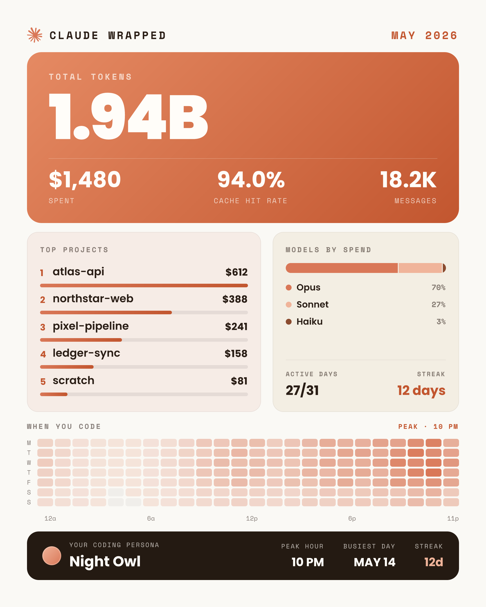
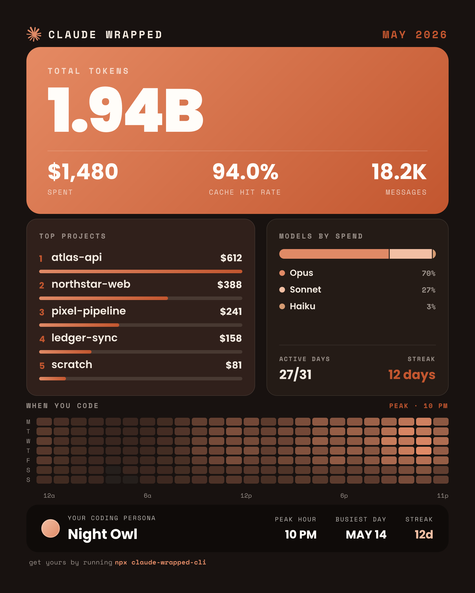

<div align="center">

# Claude Wrapped

A **Spotify-Wrapped-style** image of your Claude Code usage — total tokens, spend, cache hit
rate, top projects, model split, an activity heatmap, and your "coding persona" — rendered from
your local logs, nothing uploaded.

<!-- status: live npm + repo/social -->
[](https://www.npmjs.com/package/claude-wrapped-cli)
[](https://www.npmjs.com/package/claude-wrapped-cli)
[](https://github.com/lucas-amberg/claude-wrapped/stargazers)
[](apps/cli/README.md#license)
[](https://github.com/lucas-amberg/claude-wrapped/pulls)

<!-- tech stack -->


<a href="https://claude-wrapped.vercel.app"><b>🌐 View the site →</b></a>

<p align="center">
  <a href="https://claude-wrapped-zeta.vercel.app"><b>🌐 View the site →</b></a>
</p>
 



<sub>Sample cards (illustrative data) — default and <code>--dark</code> themes.</sub>

</div>

This repository is a **Turborepo + Bun monorepo** with two apps: the published CLI and a
marketing/documentation website that shows it off.

## Try the CLI

```bash
npx claude-wrapped-cli            # current month → ~/Desktop, then opens it
npx claude-wrapped-cli --dark     # warm near-black dark theme
```

Full CLI documentation — every flag and how it works — lives in
**[`apps/cli/README.md`](apps/cli/README.md)** (this is what npm renders).

## Monorepo layout

```
claude-wrapped/
├── apps/
│   ├── cli/      # the published `claude-wrapped-cli` npm CLI (Bun · tsup · Satori → resvg)
│   └── web/      # the marketing/docs site (Next.js 16 · Tailwind v4 · static)
├── turbo.json    # build / dev / typecheck / lint pipeline
└── package.json  # workspaces + turbo pass-through scripts
```

The CLI is the source of truth for the design: the website's palette and fonts **mirror**
[`apps/cli/src/render/theme.ts`](apps/cli/src/render/theme.ts) (its `LIGHT`/`DARK` token sets),
so the page re-themes light↔dark exactly like the rendered card.

## Quick start

```bash
bun install        # installs every workspace from the repo root
bun run dev        # turbo: runs the CLI watcher + the website (localhost:3000)
bun run build      # turbo: builds apps/cli/dist + apps/web/.next
bun run typecheck  # turbo: typechecks both apps
bun run lint       # turbo: lints the web app
```

Work on one app at a time:

```bash
bun --filter claude-wrapped-cli dev   # CLI only (tsup --watch)
bun --filter web dev              # website only (next dev)
```

## Deploying the site

The site is a static Next.js app, ready for [Vercel](https://vercel.com):

1. Import the repo into Vercel.
2. Set **Root Directory** to `apps/web` (Vercel auto-detects Next.js + Bun from there).
3. Deploy. No environment variables are required — the site is fully static.

The live deployment is **<https://claude-wrapped-zeta.vercel.app>**. To self-host under a
different URL, set `NEXT_PUBLIC_SITE_URL` (it feeds the metadata/OG defaults in
[`apps/web/app/layout.tsx`](apps/web/app/layout.tsx)).

## Acknowledgements

Inspired by [`ccusage`](https://github.com/ryoppippi/ccusage) — the project that got me poking
at Claude Code usage in the first place. Both read the same LiteLLM pricing source.

## License

MIT. Claude logo © Anthropic; bundled fonts under the SIL Open Font License.
