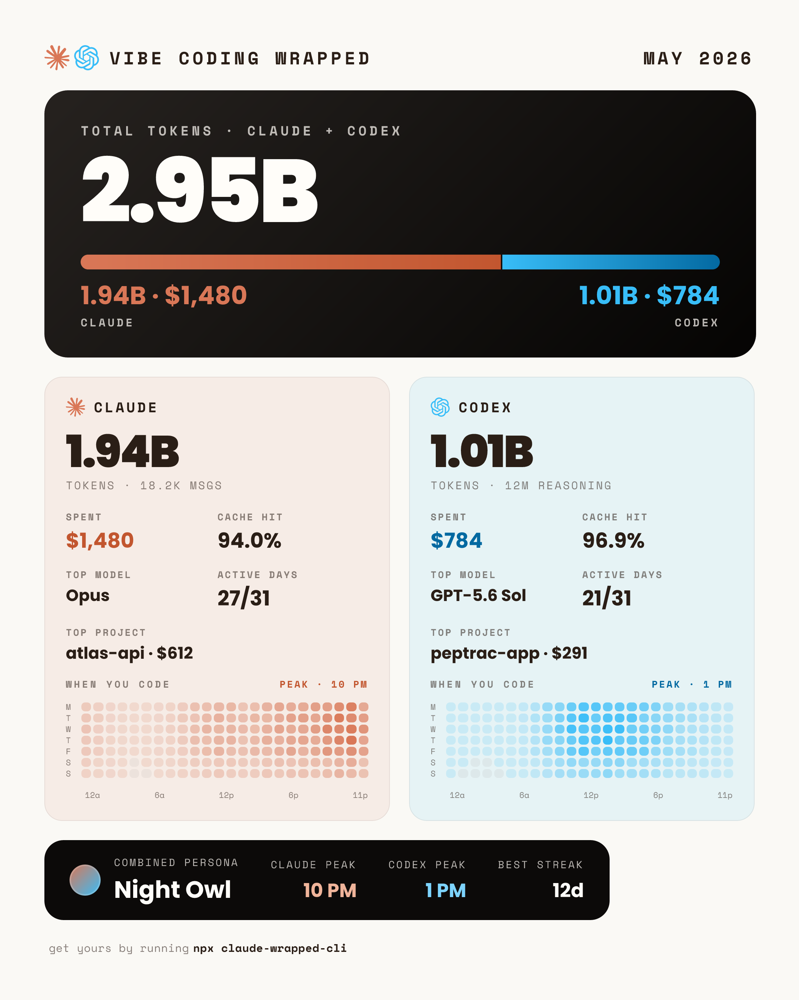
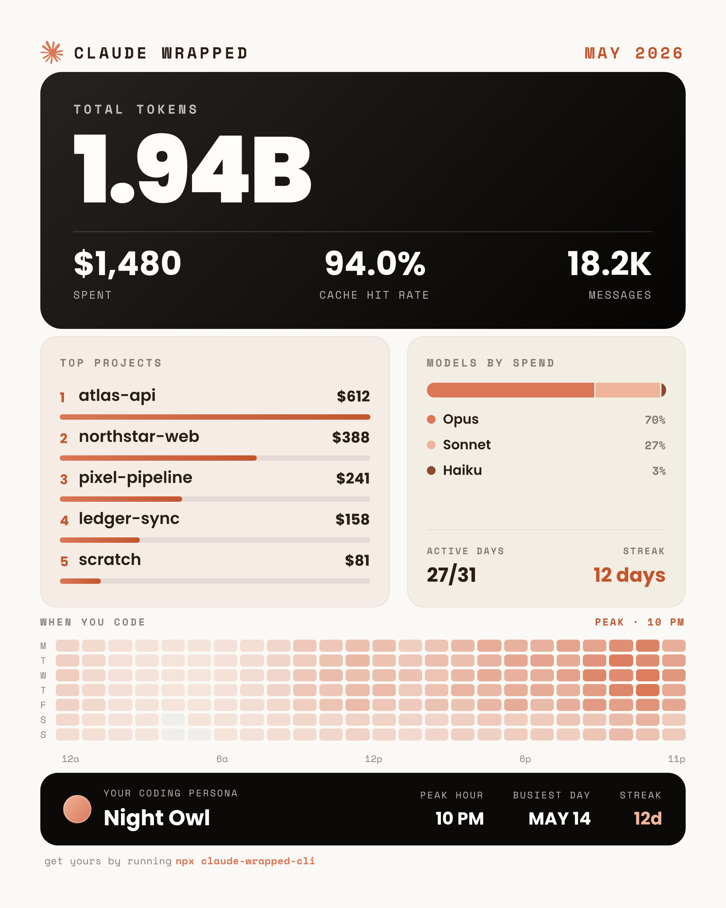
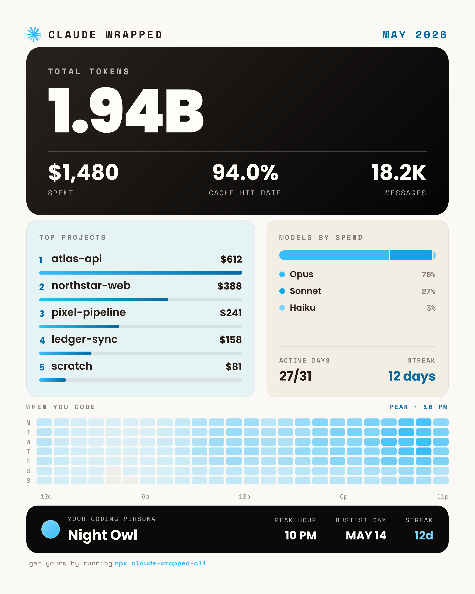

# Vibe Coding Wrapped

A **Spotify-Wrapped-style** image of your AI coding usage — for **Claude Code** *and* **Codex**.
Point it at a month and it generates an aesthetic card — total tokens, spend, cache hit rate, top
projects, model split, an activity heatmap, and your "coding persona" — then saves it to your
Desktop and opens it.

By default it tracks **both** agents and renders one combined card. Pass `--claude` or `--codex`
to get a single standalone card instead. Each design is black-first with its own accent —
**coral for Claude, cyan for Codex**.

It's self-contained: it reads your local logs directly (`~/.claude/projects/**/*.jsonl` and
`~/.codex/sessions/**/*.jsonl`) and computes cost from per-model
[LiteLLM](https://github.com/BerriAI/litellm) pricing — nothing is uploaded.

<p align="center">
  
</p>
<p align="center"><sub>The default: one combined card (illustrative data).</sub></p>

<p align="center">
  
  
</p>
<p align="center"><sub>Standalone cards via <code>--claude</code> / <code>--codex</code> (each also has a <code>--dark</code> theme).</sub></p>

> 🌐 **There's a website:** see [the landing page](https://claude-wrapped-zeta.vercel.app)
> for a tour of every panel, the install guide, and the design story. This package lives in the
> [`claude-wrapped` monorepo](https://github.com/lucas-amberg/claude-wrapped) under `apps/cli`.

## Install

```bash
# one-off
npx claude-wrapped-cli

# or global
npm i -g claude-wrapped-cli   # (bun add -g claude-wrapped-cli)
claude-wrapped-cli
```

## Usage

```bash
claude-wrapped-cli                          # current month, both agents → combined card
claude-wrapped-cli --claude                 # Claude Code only (standalone)
claude-wrapped-cli --codex                  # Codex only (standalone)
claude-wrapped-cli --month 2026-05          # a specific month
claude-wrapped-cli --month 2026-05 --output ~/wrapped.png
claude-wrapped-cli --offline                # skip the pricing fetch (use bundled/cached)
claude-wrapped-cli --dark                   # render the dark theme
claude-wrapped-cli --json                   # also print computed stats to stdout
```

If you only use one agent, the default still works — it renders that agent's standalone card
automatically. `--claude` and `--codex` are only needed to force a single card when you have
data from both.

### Options

| Flag | Default | Description |
|------|---------|-------------|
| `--claude` | _both agents_ | Only track Claude Code (standalone card). |
| `--codex` | _both agents_ | Only track Codex (standalone card). |
| `--month <YYYY-MM>` | current month | Month to summarize. |
| `--output <path>` | `~/Desktop/<name>-<month>.png` | Where to save the PNG. |
| `--timezone <iana>` | system local | Timezone for date grouping (hours, days, streaks). |
| `--no-open` | _opens by default_ | Don't open the image after saving. |
| `--offline` | off | Use cached/bundled pricing only — no network. |
| `--scale <n>` | `2` | Render scale; 2× → a crisp high-res PNG. |
| `--dark` | off | Use the dark theme (near-black). |
| `--json` | off | Print the computed stats as JSON to stdout. |

The default output filename is `vibe-coding-wrapped-<month>.png` for the combined card, or
`claude-wrapped-<month>.png` / `codex-wrapped-<month>.png` for a standalone one. You can also pass
the month positionally: `claude-wrapped-cli 2026-05`.

`--json` prints the flat stats object for a single agent, or `{ "claude": …, "codex": … }` for the
combined card.

If your config lives somewhere non-standard, set `CLAUDE_CONFIG_DIR` and/or `CODEX_HOME`.

## How it works

1. **Load** — streams every log line-by-line (never loads a file whole), keeps the target month,
   and **dedups** resumed sessions.
   - *Claude* — `assistant` messages under `~/.claude/projects`, deduped by `requestId:message.id`.
   - *Codex* — `~/.codex/sessions/**/*.jsonl` rollout files. Both the current
     (`token_usage_record`) and older (`event_msg`/`token_count`) formats are supported, deduped by
     response id. Codex reports the cached slice *inside* `input_tokens`, so it's split back out at
     load time — keeping token totals, cache-hit rate, and cost correct.
2. **Price** — fetches the LiteLLM price table (cached 24h under `~/.claude-wrapped/`, with a
   bundled fallback so first run / offline still works) and computes cost per record. Codex models
   that aren't in the table show `$0`.
3. **Aggregate** — totals, cache hit rate, top projects (worktrees rolled up to their parent repo),
   per-model split, peak hour / persona / busiest day / longest streak, and a 7×24 activity heatmap
   — all in your timezone.
4. **Render** — builds the card with [Satori](https://github.com/vercel/satori) (HTML/flexbox → SVG)
   and rasterizes it to PNG with [resvg](https://github.com/yisibl/resvg-js). Fonts (Poppins +
   Space Mono) are embedded in the binary.

## Development

This package is the `apps/cli` workspace of the [`claude-wrapped`](https://github.com/lucas-amberg/claude-wrapped)
monorepo. Run these from `apps/cli`:

```bash
bun install                   # (from the repo root — installs all workspaces)
bun run build                 # tsup → dist/cli.js

# fast iteration (no build needed — fonts read from disk):
bun dev/stats.ts  2026-05     # dump WrappedStats JSON
bun dev/render.ts             # render mockup/satori.png from a stats JSON
bun dev/mockup.ts             # write mockup/index.html (browser preview, fonts inlined)
bun dev/sample.ts             # regenerate the committed docs/ sample cards
```

You can also drive everything from the repo root with Turborepo: `bun run build`,
`bun run typecheck`, `bun run dev` (runs the CLI watcher alongside the website).

The card layout lives in `src/render/card-markup.ts` and is shared verbatim between the HTML
mockup and the Satori renderer, so the preview can't drift from the output.

## License

MIT. Claude logo © Anthropic; OpenAI logo © OpenAI; bundled fonts under the SIL Open Font License.
